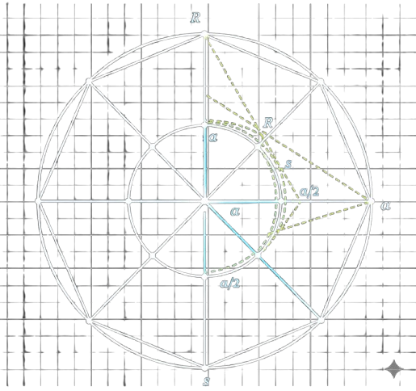

# Hi, I'm Arindam 👋

I am a systems & computational learner focused on translating
**theory → implementation** through code, simulation, and experimentation.

My interests span:
- Embedded systems
- Computational physics
- Mathematical & algorithmic thinking
- Programming as a tool for understanding systems

---

## 🧭 How to Explore My Work

### 📌 Systems Learning Index
A structured map of my learning, projects, and explorations:
- **Systems Learning Log**  
  → [My Learning Log](https://github.com/arindam-codes/systems-learning-log)

---

### 🧠 Projects (Theory → Implementation)

- **Law of Sines Visualizer**  
  Computational geometry using trigonometry and visualization  
  → [Law of Sines Visualizer](https://github.com/arindam-codes/law-of-sines-visualizer)

- **General Root Finder**  
  Numerical root-finding via the bisection method  
  → [General Root Finder](https://github.com/arindam-codes/general-root-finder)

---

### 📚 Learning & Exploration

- **Computational Physics Exploration (First Semester)**  
  Augmenting classical mechanics with numerical methods  
  → [Exploring First-Semester Physics via Computation](https://github.com/arindam-codes/trying-to-learn-1st-sem-physics-in-a-new-way-)

- **First Semester Learning Reflection**  
  Decisions, corrections, and learning strategy  
  → [First-semester learning reflection](https://github.com/arindam-codes/1st-month-of-1st-semeter-)

---

## 🛠️ Tools & Technologies

  
  
  
  
  
  

  
  

---

## 📌 Note
This profile represents **learning in public**, not finished expertise.
Projects emphasize clarity, abstraction, and correctness over polish.
