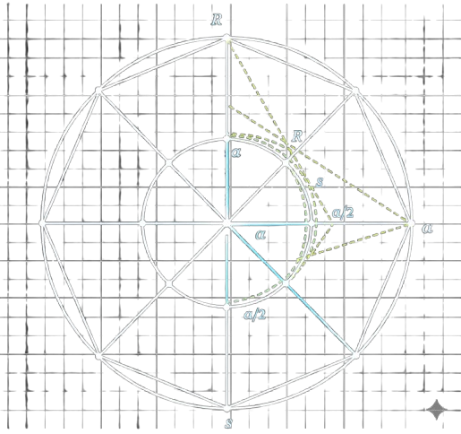

# Hi, I'm Arindam 👋

I am a systems & computational learner focused on translating
**theory → implementation** through code, simulation, and experimentation.

My interests span:
- Embedded systems
- Computational physics
- Mathematical & algorithmic thinking
- Game Development
- Programming as a tool for understanding systems

---

## How to Explore My Work

### Systems Learning Index
A structured map of my learning, projects, and explorations:
- **Systems Learning Log**  
  → [My Learning Log](https://github.com/arindam-codes/systems-learning-log)

---  

## Interactive System Experiment

### Roblox Cinematic Experience — Environmental Storytelling

A real-time interactive system exploring camera control, lighting psychology, and player-state manipulation to communicate meaning without UI or dialogue.

→ Repository: https://github.com/arindam-codes/roblox-cinematic-experience

---

### Projects (Theory → Implementation)

- **Law of Sines Visualizer**  
  Computational geometry using trigonometry and visualization  
  → [Law of Sines Visualizer](https://github.com/arindam-codes/law-of-sines-visualizer)

- **General Root Finder**  
  Numerical root-finding via the bisection method  
  → [General Root Finder](https://github.com/arindam-codes/general-root-finder)

 - **DayFlow RPC — Time-Aware Discord Presence**  
  A local Python system that maps real-world time → activity state and reflects it via Discord Rich Presence.

    Built as my **first real-world systems project** after completing *MIT 6.100L*, DayFlow RPC , here I tried to solve a human problem:  
    making focus, availability, and transitions visible without manual communication.
  → [DayFlow RPC (Live, time-driven system)](https://github.com/arindam-codes/DayFlow-RPC)

---

### Learning & Exploration

- **Computational Physics Exploration (First Semester)**  
  Augmenting classical mechanics with numerical methods  
  → [Exploring First-Semester Physics via Computation](https://github.com/arindam-codes/trying-to-learn-1st-sem-physics-in-a-new-way-)

- **First Semester Learning Reflection**  
  Decisions, corrections, and learning strategy  
  → [First-semester learning reflection](https://github.com/arindam-codes/1st-month-of-1st-semeter-)

---

### Implementation Philosophy
> The same ideas I study mathematically, I try to make run in real environments.

## 🛠️ Tools & Technologies

### Mathematical & Scientific Computing

  
  
  
  
  

### Frontend & Web Systems

  
  
  

### Systems & Low-Level Thinking

  
  
   
  

### Development Environment

  
  
  

### Real-Time Interactive Runtime

  
  
  

---

## Note
This profile represents **learning in public**, not finished expertise.
Projects emphasize clarity, abstraction, and correctness over polish.

---

## 🌐 Connect With Me

  
  
  
  
  
  
  
  
  

  

