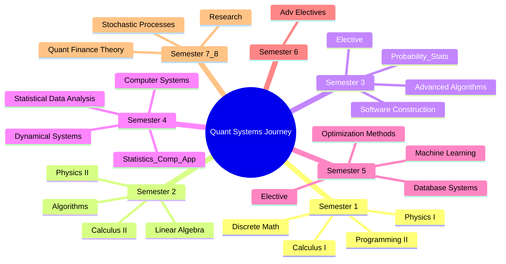
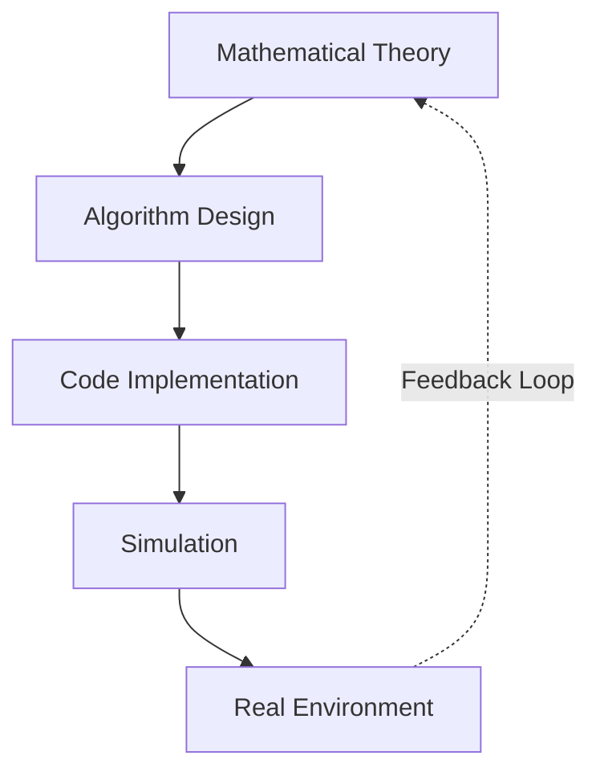

  
<!-- ULTRA AESTHETIC HEADER -->

  
  
  
  

---

 <table> <tr> <td width="70%"> <h3>🎯 Research Interests</h3> 
 <code>◈ Stochastic Calculus & Randomness</code>  <code>◈ Probability Theory (Measure-Theoretic Depth)</code>  <code>◈ Quantitative Finance & Market Microstructure</code>  <code>◈ Mathematical Intuition as a Way of Seeing</code>  <code>◈ Computational Systems & Infrastructure</code>  <code>◈ Research & SaaS</code> 
 </td> <td width="30%" align="center">  </td> </tr> </table> 

---

## 🔬 Projects: Theory → Implementation

---

## 📡 Systems Learning Index — MIT Curriculum

```mermaid
mindmap
  root((Quant Systems Journey))
    
    Semester 1
      Calculus I
      Programming II
      Discrete Math
      Physics I
    
    Semester 2
      Calculus II
      Physics II
      Linear Algebra
      Algorithms
    
    Semester 3
      Probability_Stats
      Software Construction
      Advanced Algorithms
      Elective
    
    Semester 4
      Computer Systems
      Statistical Data Analysis
      Dynamical Systems
      Statistics_Comp_App
    
    Semester 5
      Machine Learning
      Database Systems
      Optimization Methods
      Elective
    
    Semester 6
      Adv Electives

    Semester 7_8
      Stochastic Processes
      Quant Finance Theory
      Research
```

<h3>⚡ Implementation Philosophy</h3>

The same ideas I study mathematically, I try to make run in real environments.

```mermaid
flowchart TD
    A[Mathematical Theory] --> B[Algorithm Design]
    B --> C[Code Implementation]
    C --> D[Simulation]
    D --> E[Real Environment]
    E -.->|Feedback Loop| A
```

 
  
## 🛠️ Tech Stack

`Python` • `NumPy` • `Pandas` • `SciPy` • `Matplotlib`
`HTML` • `CSS` • `JS` • `C` • `C++`
`Linux` • `Git` • `Lua` • `Luau`
`VSCode` • `Jupyter` • `Spyder`

  

