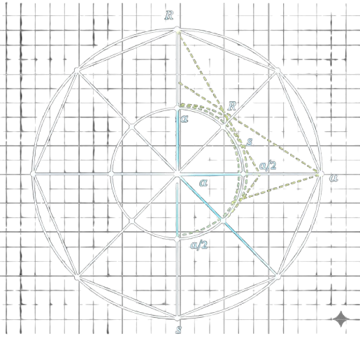
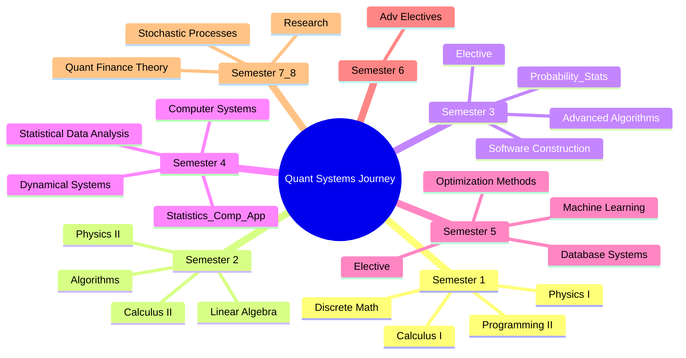
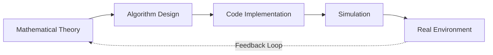

  
<!-- ULTRA AESTHETIC HEADER -->

  
  
  
  

---

 <table> <tr> <td width="70%"> <h3>🎯 Research Interests</h3> 
 <code>◈ Stochastic Calculus & Randomness</code>  <code>◈ Probability Theory (Measure-Theoretic Depth)</code>  <code>◈ Quantitative Finance & Market Microstructure</code>  <code>◈ Mathematical Intuition as a Way of Seeing</code>  <code>◈ Computational Systems & Infrastructure</code>  <code>◈ Research & SaaS</code> 
 </td> <td width="30%" align="center">  </td> </tr> </table> 

---

## 📡 Systems Learning Index — MIT Curriculum

```mermaid
mindmap
  root((Quant Systems Journey))
    
    Semester 1
      Calculus I
      Programming II
      Discrete Math
      Physics I
    
    Semester 2
      Calculus II
      Physics II
      Linear Algebra
      Algorithms
    
    Semester 3
      Probability_Stats
      Software Construction
      Advanced Algorithms
      Elective
    
    Semester 4
      Computer Systems
      Statistical Data Analysis
      Dynamical Systems
      Statistics_Comp_App
    
    Semester 5
      Machine Learning
      Database Systems
      Optimization Methods
      Elective
    
    Semester 6
      Adv Electives

    Semester 7_8
      Stochastic Processes
      Quant Finance Theory
      Research
```

  

🎮 Interactive System Experiment

Roblox Cinematic Experience — Environmental Storytelling  
A real-time interactive system exploring camera control, lighting psychology, and player-state manipulation to communicate meaning without UI or dialogue.

🔬 Projects: Theory → Implementation

<table>
<tr>
<th>Project</th>
<th>Description</th>
<th>Stack</th>
</tr>

<tr>
<td> Law of Sines Visualizer</td>
<td>Computational geometry using trigonometry</td>
<td>NumPy, Matplotlib</td>
</tr>

<tr>
<td> General Root Finder</td>
<td>Numerical root-finding via bisection method</td>
<td>SciPy, Custom Algos</td>
</tr>

<tr>
<td> DayFlow RPC</td>
<td>Time-aware Discord Rich Presence system</td>
<td>Python, Discord API</td>
</tr>

<tr>
<td> Roblox Cinematic Experience</td>
<td>Real-time environmental storytelling</td>
<td>Luau, Roblox Studio</td>
</tr>

</table>

 

  
## 📖 Learning & Exploration

### 🔬 Computational Physics Exploration

> *Augmenting classical mechanics with numerical methods*

### 📝 First Semester Learning Reflection

> *Decisions, corrections, and learning strategy*

⚡ Implementation Philosophy  
The same ideas I study mathematically, I try to make run in real environments.

```mermaid
flowchart LR
    A[Mathematical Theory] --> B[Algorithm Design]
    B --> C[Code Implementation]
    C --> D[Simulation]
    D --> E[Real Environment]
    E -.->|Feedback Loop| A
```

 

🛠️ Tools & Technologies

Mathematical & Scientific Computing

      

Frontend & Web Systems

    

Systems & Low-Level Thinking

     

Development Environment

    

Real-Time Interactive Runtime

     

📝 Note
This profile represents learning in public, not finished expertise.
Projects emphasize clarity, abstraction, and correctness over polish.

🌐 Connect With Me

  &nbsp;&nbsp;  &nbsp;&nbsp;  &nbsp;&nbsp;  &nbsp;&nbsp;  &nbsp;&nbsp;  

  

