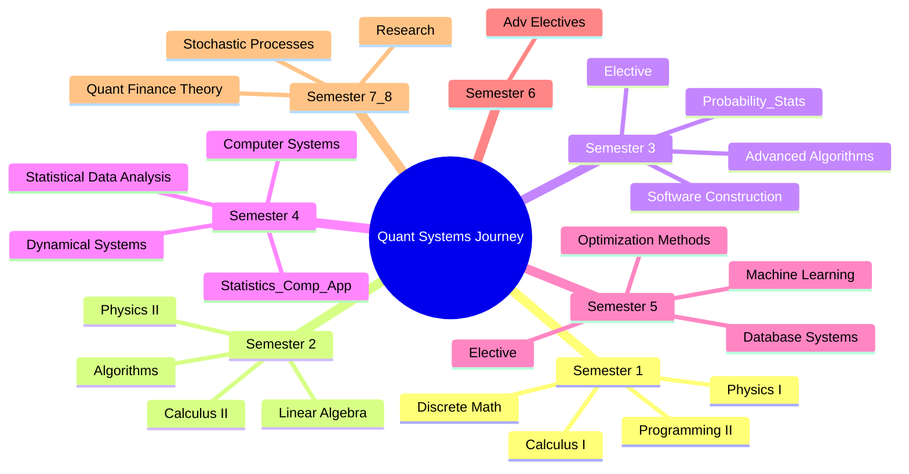
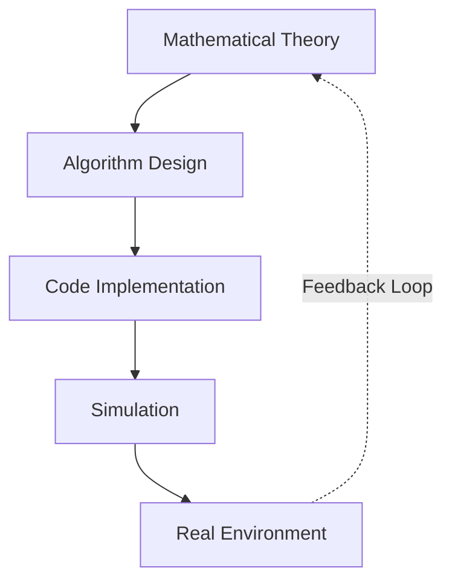

  
<!-- ULTRA AESTHETIC HEADER -->

  
  
  
  

---

 <table> <tr> <td width="70%"> <h3>🎯 Research Interests</h3> 
 <code>◈ Stochastic Calculus & Randomness</code>  <code>◈ Probability Theory (Measure-Theoretic Depth)</code>  <code>◈ Quantitative Finance & Market Microstructure</code>  <code>◈ Mathematical Intuition as a Way of Seeing</code>  <code>◈ Computational Systems & Infrastructure</code>  <code>◈ Research & SaaS</code> 
 </td> <td width="30%" align="center">  </td> </tr> </table> 

---

## 🔬 Projects: Theory → Implementation

## 🧠 Mathematical & Quantitative Projects

<table>
  <tr>
    <td width="50%">
      <h3>📈  knapsack portfolio optimization python</h3>
      
Greedy algorithm for constrained portfolio selection. Models the 0/1 knapsack problem applied to stocks under budget constraints.

      <strong>Tech Stack:</strong> Python • Algorithms • Optimization
        
      
    </td>
    <td width="50%">
      <h3>🎯 Freelancer's Dilemma Solver</h3>
      
Decision engine for optimal job selection under time, cost and value constraints. Real-world optimization modeled computationally.

      <strong>Tech Stack:</strong> Python • Decision Systems • Constraint Modeling
        
      
    </td>
  </tr>
  <tr>
    <td width="50%">
      <h3>🔢 General Root Finder</h3>
      
Numerical methods engine implementing bisection method. Mathematics becoming executable code.

      <strong>Tech Stack:</strong> Python • Numerical Methods • Computational Math
        
      
    </td>
    <td width="50%">
      <h3>📐 Law of Sines Visualizer</h3>
      
Interactive computational geometry system. Built to understand trigonometric relationships dynamically — not just calculate them.

      <strong>Tech Stack:</strong> Python • Geometry • Mathematical Visualization
        
      
    </td>
  </tr>
  <tr>
    <td width="50%">
      <h3>⏱️ DayFlow discord rich presence python</h3>
      
Time-based state machine mapping real-world activity to Discord presence. Systems thinking applied to daily life.

      <strong>Tech Stack:</strong> Python • State Machines • Automation
        
      
    </td>
    <td width="50%">
      <h3>🎬 Roblox Cinematic System</h3>
      
~900 lines of client-server Luau. Event-driven architecture. Key realization: systems can communicate, not just compute.

      <strong>Tech Stack:</strong> Luau • Systems Architecture • Real-Time
        
      
    </td>
  </tr>
</table>

## 🧩 Systems & Computational Learning

<table>
  <tr>
    <td width="50%">
      <h3>📚 Systems Learning Log</h3>
      
Structured public documentation of learning across mathematics, physics, and computation. MIT OCW curriculum — Calculus, Linear Algebra, Probability, Programming.

      <strong>Tech Stack:</strong> MIT OCW • Mathematics • Building in Public
        
      
    </td>
    <td width="50%">
      <h3>⚛️ Computational Physics</h3>
      
Classical mechanics simulated through code. Understanding physics by building it — not just calculating it.

      <strong>Tech Stack:</strong> Python • Physics Simulation • Classical Mechanics
        
      
    </td>
  </tr>
</table>

## 📦 Additional Work

<table>
  <tr>
    <td width="25%">
      <h3>🎓 CS50</h3>
      
    </td>
    <td width="25%">
      <h3>🐼 Pandas Practice</h3>
      
    </td>
    <td width="25%">
      <h3>💡 MicroPython Labs</h3>
      
    </td>
    <td width="25%">
      <h3>🎮 Roblox Scripting</h3>
      
    </td>
  </tr>
</table>

---

## 📡 Systems Learning Index — MIT Curriculum

```mermaid
mindmap
  root((Quant Systems Journey))
    
    Semester 1
      Calculus I
      Programming II
      Discrete Math
      Physics I
    
    Semester 2
      Calculus II
      Physics II
      Linear Algebra
      Algorithms
    
    Semester 3
      Probability_Stats
      Software Construction
      Advanced Algorithms
      Elective
    
    Semester 4
      Computer Systems
      Statistical Data Analysis
      Dynamical Systems
      Statistics_Comp_App
    
    Semester 5
      Machine Learning
      Database Systems
      Optimization Methods
      Elective
    
    Semester 6
      Adv Electives

    Semester 7_8
      Stochastic Processes
      Quant Finance Theory
      Research
```

<h3>⚡ Implementation Philosophy</h3>

The same ideas I study mathematically, I try to make run in real environments.

```mermaid
flowchart TD
    A[Mathematical Theory] --> B[Algorithm Design]
    B --> C[Code Implementation]
    C --> D[Simulation]
    D --> E[Real Environment]
    E -.->|Feedback Loop| A
```

 
  
## 🛠️ Tech Stack

`Python` • `NumPy` • `Pandas` • `SciPy` • `Matplotlib`
`HTML` • `CSS` • `JS` • `C` • `C++`
`Linux` • `Git` • `Lua` • `Luau`
`VSCode` • `Jupyter` • `Spyder`

  

